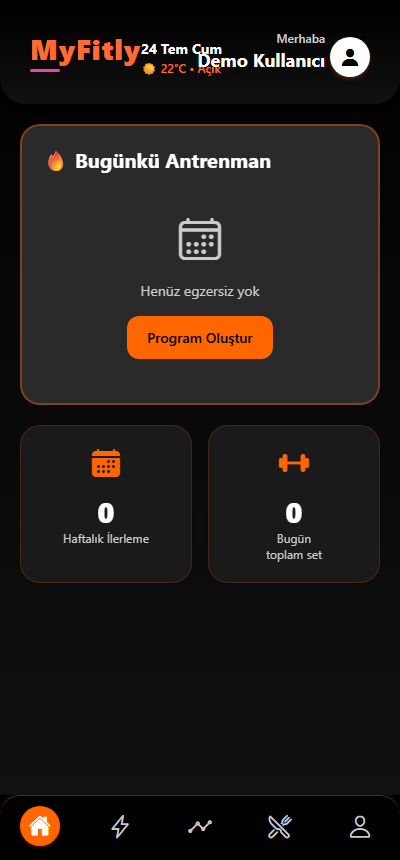
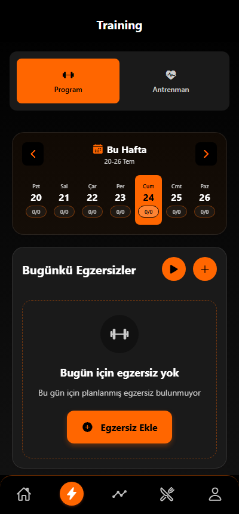
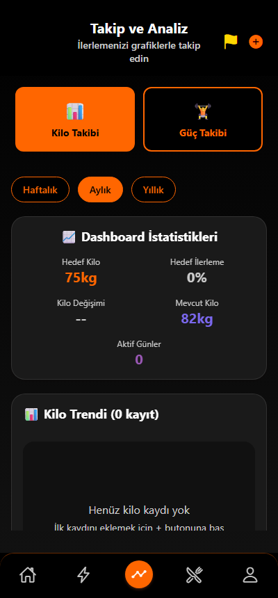
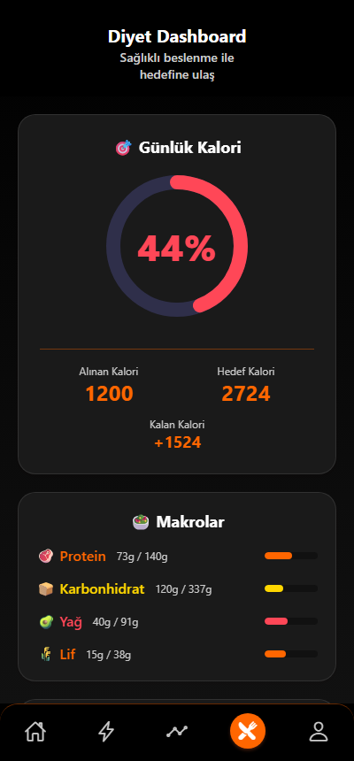
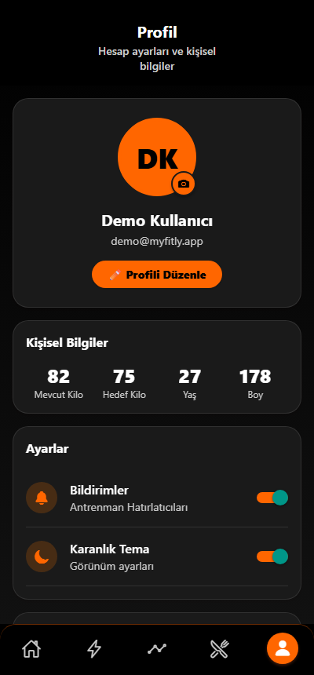
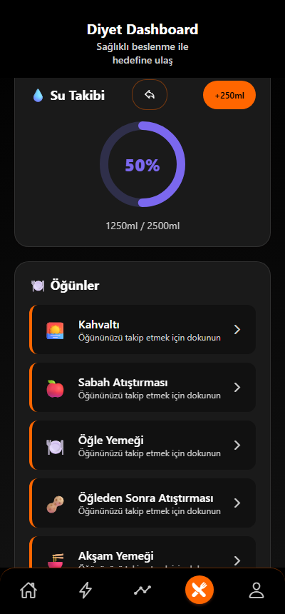
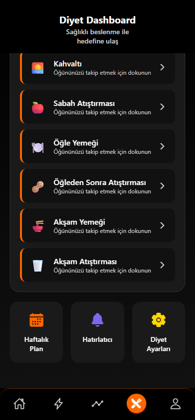

# MyFitly

A fitness & diet tracking mobile app built with **React Native (Expo)** and **Supabase**. Users track workouts, body weight, and diet/calories, with English/Turkish localization and light/dark theming throughout.

> This is a personal/portfolio project. The screenshots below were captured against demo data; the live backend used during development is not included in this repo (see [Backend](#backend) below).

## Screenshots

| Login | Register | Dashboard |
|---|---|---|
|  |  |  |

| Training | Tracking | Diet |
|---|---|---|
|  |  |  |

| Profile | Diet — Water & Meals | Diet — Meal Slots |
|---|---|---|
|  |  |  |

## Features

- **Auth & onboarding** — email/password sign-up and sign-in (Supabase Auth), guided profile setup (age, height, weight, goals)
- **Dashboard** — daily overview: today's workout, weekly progress, weight-goal progress
- **Training** — weekly workout program builder, exercise logging, custom exercises
- **Tracking** — weight and strength progress over time with charts (weekly/monthly/yearly views)
- **Diet** — meal planning, food/calorie logging, water intake tracking
- **Notifications** — local reminders for meals, water, and workouts
- **Weather-aware suggestions** — via OpenWeatherMap, with automatic fallback to demo data if no key/location is available
- **Localization** — English and Turkish, switchable in-app
- **Light/dark theme**
- **AdMob integration** for free-tier users, with a "Pro" paywall UI (see note below)

## Tech Stack

- [Expo](https://expo.dev) SDK 54 / React Native 0.81 / React 19
- [Supabase](https://supabase.com) — Postgres + Auth
- React Navigation (bottom tabs + native stack)
- `react-native-chart-kit` + `react-native-svg` for charts
- `expo-notifications`, `expo-location`, `expo-image-picker`
- ESLint (`eslint-config-expo`) for linting

## Project Structure

```

├── src/
│   ├── screens/       # one file per app screen
│   ├── components/    # shared UI components
│   ├── context/       # Theme, User, Language, Subscription providers
│   ├── services/      # Supabase-backed data access + ads/notifications/weather
│   ├── locales/       # en.js / tr.js translation dictionaries
│   └── theme/         # colors, spacing
├── SQLs/realsqls/      # Postgres schema & migrations (run in numeric order)
├── .env.example        # required environment variables (see below)
└── app.json / eas.json # Expo & EAS build configuration
```

## Getting Started

```bash
cd MyFitly
npm install
cp .env.example .env   # then fill in your own keys, see below
npx expo start
```

### Environment variables

Copy `.env.example` to `.env` and fill in:

```
EXPO_PUBLIC_SUPABASE_URL=
EXPO_PUBLIC_SUPABASE_ANON_KEY=
EXPO_PUBLIC_OPENWEATHER_API_KEY=
```

- **Supabase**: create a free project at [supabase.com](https://supabase.com), then run the SQL files under `SQLs/realsqls/` against it **in numeric order** to create the schema (users, workouts, diet, tracking, subscriptions, RLS policies).
- **OpenWeatherMap**: a free key from [openweathermap.org/api](https://openweathermap.org/api). Optional — the app falls back to demo weather data if this is missing.

Without a configured Supabase project, the app still starts, but auth/data screens will show connection errors — this is expected, not a bug.

### Backend

This repo does **not** ship a live backend. The screenshots above were taken by temporarily injecting a fake session for UI capture; no live demo instance is currently hosted. To run the app end-to-end, point it at your own Supabase project as described above.

## Scripts

```bash
npm run lint      # ESLint
npm run doctor    # expo-doctor project health check
npm run export    # bundle a production build (no native compile)
npm run web       # run in a browser via react-native-web
```

## Honest limitations

This is a portfolio/learning project, not a production app. A few things worth knowing before judging it as one:

- **The "Pro" subscription is a UI demo only.** There is no real payment provider or receipt validation — activating "Pro" just flips a local flag. This is intentional and disclosed in-code (`src/context/SubscriptionContext.js`).
- No automated test suite yet.
- Web support (`npx expo start --web`) works for previewing the UI, but AdMob ads are native-only and no-op on web.

## License

No license file yet — all rights reserved by default. Open an issue if you'd like to use this code and I'll consider adding one.
